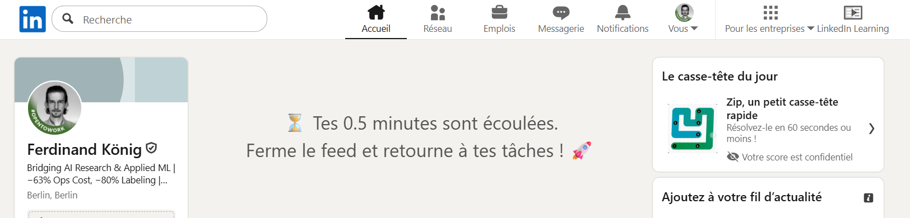
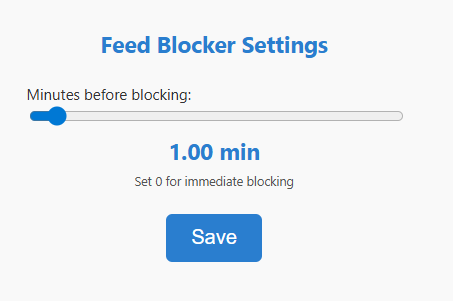

# LinkedIn Feed Blocker

A simple Chrome extension that helps you **stay focused** by blocking your LinkedIn feed after a configurable amount of time.  

Instead of mindlessly scrolling, the extension replaces your feed with a motivational message once your set time is up.  

---

## Author
Ferdinand Koenig

## License
This project is licensed under the [CC BY 4.0 License](https://creativecommons.org/licenses/by/4.0/).  

---

## Features

- Configurable time limit before the feed is blocked (0–20 minutes).  
- Immediate blocking option (set time = 0).  
- Multilingual motivational messages:
  - French, German, Spanish, or English depending on browser language.  
- Works with LinkedIn’s single-page app navigation.  

---

## Installation

1. Clone or download this repository to your computer.  
2. Open **Google Chrome** and navigate to:  
   `chrome://extensions/`  
3. Enable **Developer mode** (toggle in the top right).  
4. Click **"Load unpacked"**.  
5. Select the folder containing the extension files.  

---

## Usage

1. Open [LinkedIn Feed](https://www.linkedin.com/feed/) in Chrome.  
2. The extension will start a timer based on your settings.  
3. Once the timer expires, the feed will be replaced with a motivational message:  
   - **0 minutes:** immediate block  
   - **Other values:** block after the set time 

### Example of blocked feed:

---

## Configuring the Time Limit

1. Open the extension’s **Options page**:  
   - Go to `chrome://extensions/`  
   - Find **LinkedIn Feed Blocker** → click **Details** → click **Extension options**  
2. Use the **slider** to set your preferred time:  
   - **0:** immediate blocking  
   - **0 → 2 min:** 0.25 min steps  
   - **2 → 5 min:** 0.5 min steps  
   - **5 → 10 min:** 1 min steps  
   - **10 → 20 min:** 5 min steps  
3. Click **Save** to apply your setting.  
4. Reload the LinkedIn feed page if it was already open.  

---

## Notes

- The extension does **not collect any personal data**.  
- You can adjust the messages by editing `content.js` if you like.  
- Works **locally** without publishing to the Chrome Web Store.  

---

## Screenshot of the settings page

